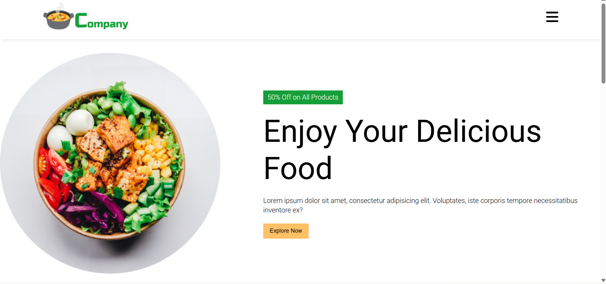

# 🍽️ Online Food Order Website

Online Food Order is a responsive restaurant-style website developed using HTML and CSS.  
The project simulates an online food ordering interface with a clean layout, attractive design, and structured sections to enhance user experience.

---

## 🚀 Technologies Used

- HTML
- CSS

---

## ✨ Features

- Responsive navigation bar
- Hero section with call-to-action
- Food items display section
- Attractive layout and styling
- Footer with contact information
- Mobile-friendly design using CSS

---

## 📸 Screenshot

Example:

.png)

---

## ▶️ How to Run the Project

1. Download or clone this repository.
2. Open the project folder.
3. Double-click on `index.html`.
4. The website will open in your browser.

---

## 📂 Project Structure

Online_Food_Order/
│── index.html
│── style.css
│── images/
│── screenshot.png
│── README.md

---

## 🌟 Future Improvements

- Add ordering functionality using JavaScript
- Add cart feature
- Integrate backend for real order processing
- Add animations and interactive elements

---

## 👩‍💻 Author

**Gauri Deshmukh**  
Aspiring Front-End Developer 🚀
